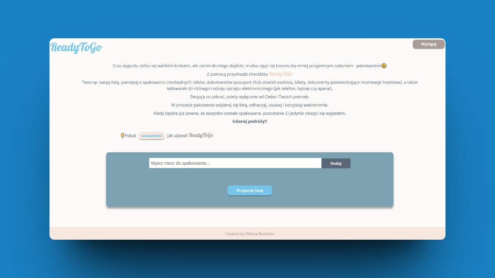
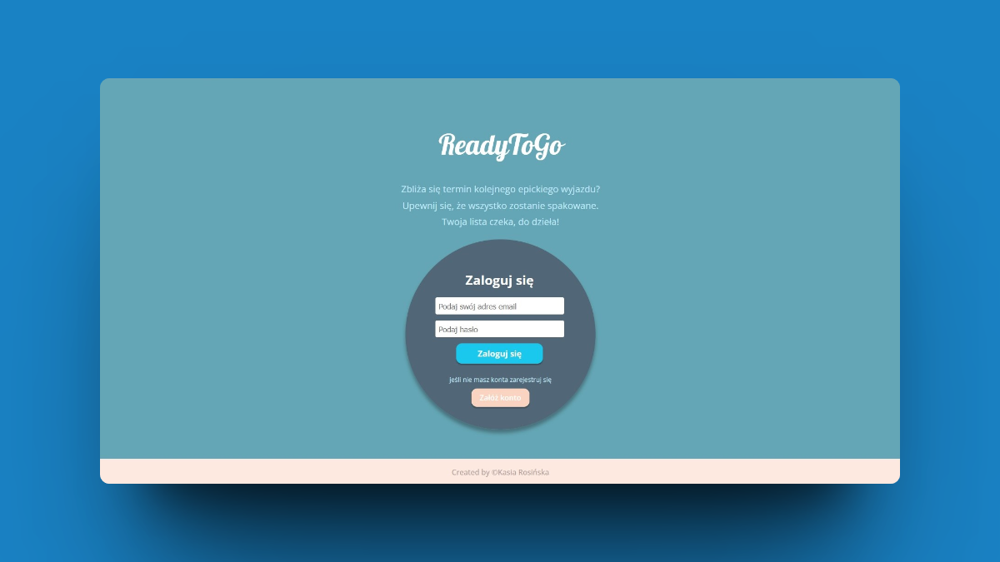
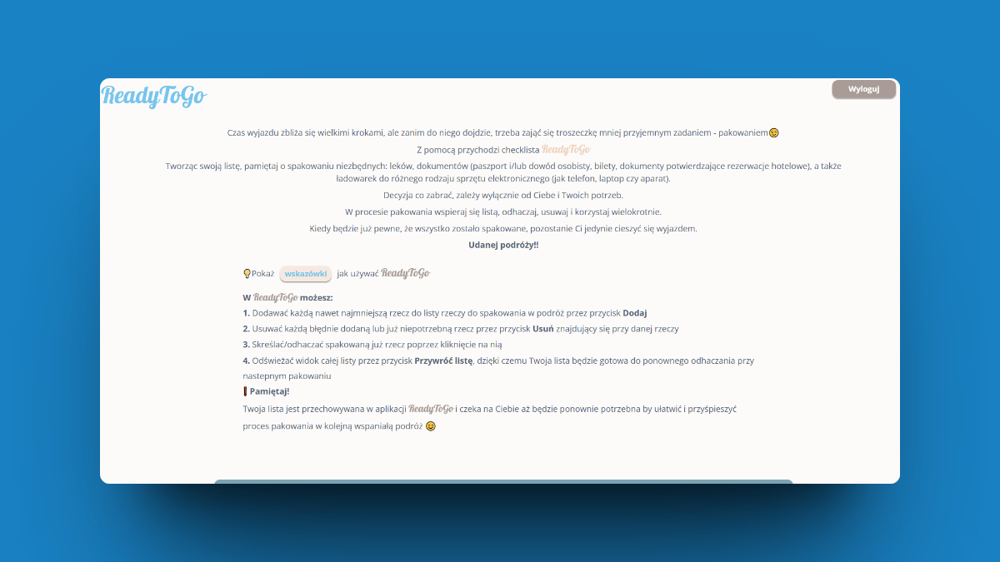
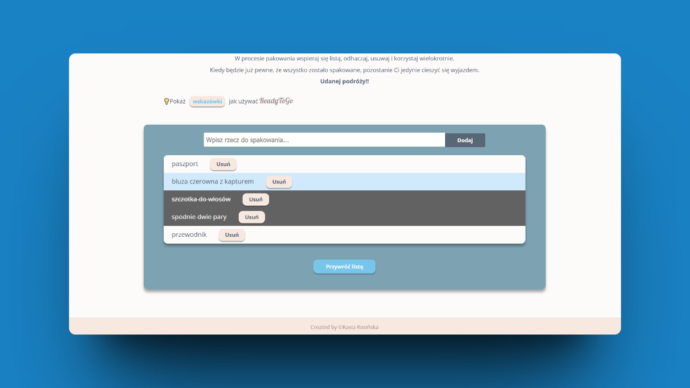
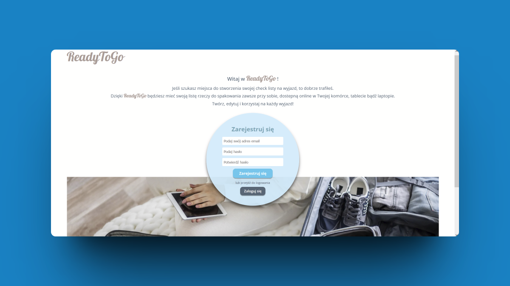
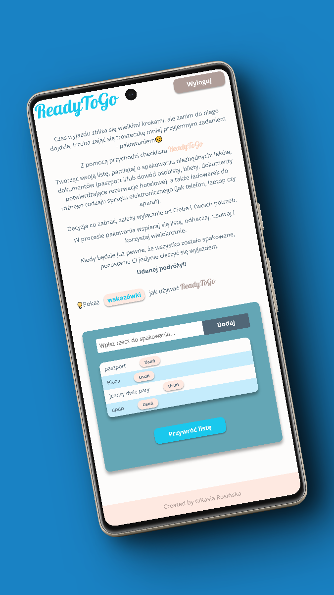
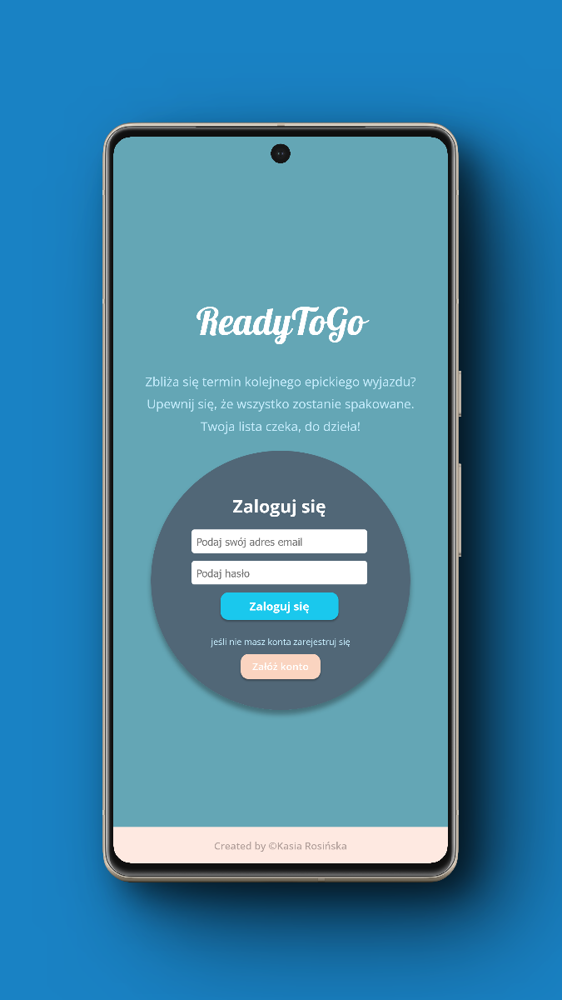
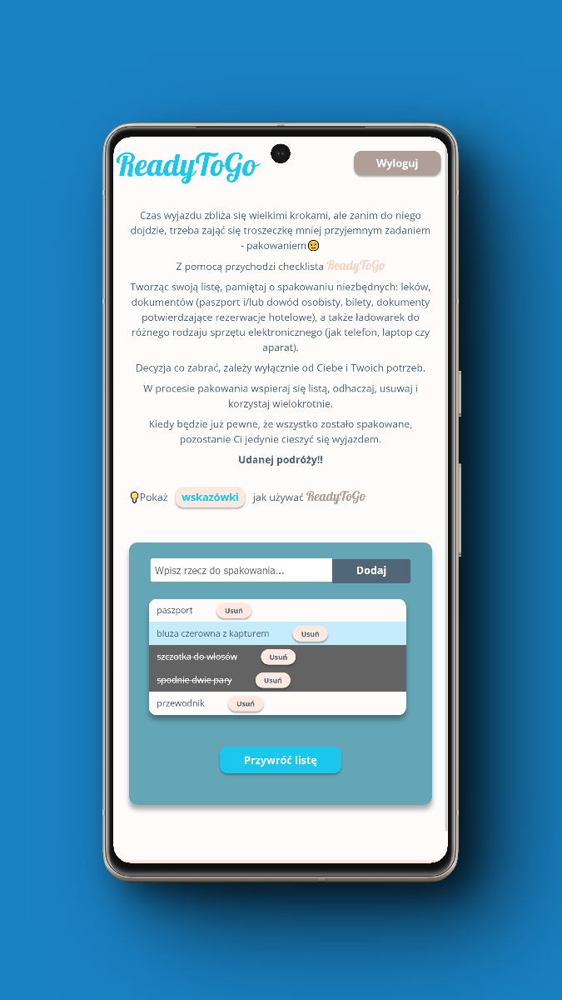
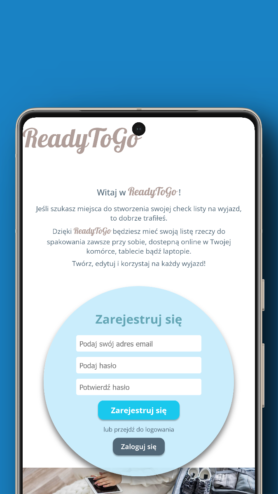

# ReadyToGo app


The **ReadyToGo** app is a to-do list where you can create your own personal packing list for each trip.
It is designed for everyone and for various types of trips. It is only limited by the user's imagination✨


Project built in React💙


To build it, I used React components, React Router DOM, Supabase as a backend support, Vite and SCSS. Thanks to the use of RWD, the application is also available in a mobile version.


## Screenshots

<div align="center"> 
  
    
  
  
  
  
  
  
  
</div>


## About the Project

This application was created from my great passion for traveling and a little less love for packing 😉

The biggest advantage of ReadyToGo is that it is a reusable list. The list once made is assigned to the user's account and waits until it is needed for the next trip. You can edit it at any time and check off the items to be packed many times.  
Therefore you can forget about the stress of creating a new packing list every time you travel somewhere💚

📱This project also has a mobile version!


## Table of Contents
- [About the project](#about-the-project)
- [Usage](#usage)
- [Technologies Used](#technologies-used)
- [Setup](#setup)
- [Environment Variables](#environment-variables)
- [License](#license)
- [Acknowledgements](#acknowledgements)
- [Contact](#contact)


## Usage

In ReadyToGo you can:
- Add even the smallest thing to the list of things to pack for a trip by clicking the Add button

- Remove each incorrectly added or no longer needed item by the Delete button next to the item

- Cross out/tick off the already packed item by clicking on it

- Refresh the view of the entire list by the Restore List button, so your list will be ready to be checked off again the next time you pack

❗️ Remember!   
Your list is stored in the ReadyToGo app and is waiting for you until you need it again to facilitate and speed up the packing process for your next great trip 😊


## Technologies Used


## Setup

This project uses npm as package manager

```bash
  npm install
```
To run locally
clone the project

```bash
  git clone https://github.com/RosinskaK/ready_to_go_project.git
```

Go to the project directory

```bash
  cd ready_to_go_project
```

Install dependencies

```bash
  npm install
```

Start the server

```bash
  npm run dev
```


## Environment Variables

To run this project, you will need to add the following environment variables to your .env file

`VITE_SUPABASE_API_KEY=`


## License

[MIT](https://choosealicense.com/licenses/mit/)


## Acknowledgements

- [Supabase](https://supabase.com/)
- [Vite](https://vitejs.dev/)
- [Animate.css](https://animate.style/)
- [Transition.css](https://www.transition.style/)
- [Netlify](https://www.netlify.com/)
- [Canva](https://www.canva.com/)
- and the constant and unfailing support of my mentor @MarceliOlszewski - to him my huge thanks and infinite gratitude 🤗


## Contact

Created by Kasia Rosińska [@RosinskaK](https://github.com/RosinskaK) - feel free to contact me! 👋

➡️ Project Link: https://readytogoapp.netlify.app 
